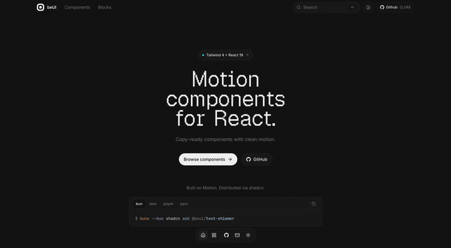

<p align="center">
  <a href="https://beui.dev">
    
  </a>
</p>

<h1 align="center">beUI v2</h1>

<p align="center">
  Motion components for React. Copy the source, own the code.
</p>

<p align="center">
  <a href="https://github.com/starc007/ui-components/blob/main/LICENSE"></a>
  <a href="https://github.com/starc007/ui-components/stargazers"></a>
  <a href="https://github.com/starc007/ui-components/actions/workflows/ci.yml"></a>
  <a href="https://ui.shadcn.com/docs/registry"></a>
</p>

<p align="center">
  <a href="https://beui.dev">Website</a>
  ·
  <a href="https://beui.dev/components/motion">Components</a>
  ·
  <a href="https://beui.dev/llms.txt">llms.txt</a>
</p>

<p align="center">
  <a href="https://beui.dev"></a>
</p>

## What is beUI?

beUI is a small component library for product interfaces.

Each component includes a live preview, usage example, source code, and a shadcn install command. The components are meant to live in your app, not behind a package.

## Install a component

Open any component page and copy the install command. beUI is in the shadcn registry directory under the `@beui` namespace.

```bash
npx shadcn@latest add @beui/animated-toast-stack
```

Direct URLs also work:

```bash
npx shadcn@latest add https://beui.dev/r/animated-toast-stack.json
```

You can also copy the source directly from the component page.

## For AI agents

beUI exposes static endpoints that coding agents can read without scraping the UI.

```txt
https://beui.dev/llms.txt
https://beui.dev/r
https://beui.dev/r/{slug}
https://beui.dev/r/{slug}.json
https://beui.dev/r/{slug}/raw
```

## Run locally

```bash
bun install
bun run dev
```

Open [http://localhost:3000](http://localhost:3000).

## Checks

```bash
bun run check
```

This runs TypeScript, Biome lint, and registry source validation.

## Contributing

Add components in `components/motion/`, previews in `components/previews/motion/`, and registry entries in `lib/registry.ts`.

Read [CONTRIBUTING.md](./CONTRIBUTING.md) before opening a PR.

## Star history

<a href="https://www.star-history.com/#starc007/ui-components&Date">
  <picture>
    <source media="(prefers-color-scheme: dark)" srcset="https://api.star-history.com/svg?repos=starc007/ui-components&type=Date&theme=dark" />
    <source media="(prefers-color-scheme: light)" srcset="https://api.star-history.com/svg?repos=starc007/ui-components&type=Date" />
    
  </picture>
</a>

## Author

Saurabh Chauhan · [@saurra3h](https://x.com/saurra3h)
