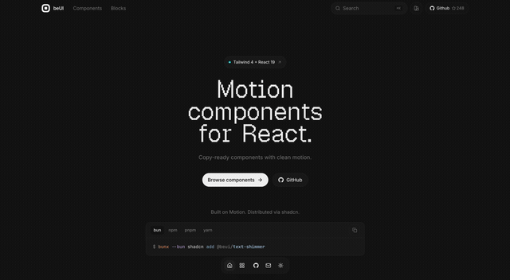

<p align="center">
  <a href="https://beui.dev">
    
  </a>
</p>

<h1 align="center">beUI - Motion Component Library</h1>

<p align="center">
  Animated components for React and Next.js. Copy the source, own the code.
</p>

<p align="center">
  <a href="https://github.com/starc007/ui-components/blob/main/LICENSE"></a>
  <a href="https://github.com/starc007/ui-components/stargazers"></a>
  <a href="https://github.com/starc007/ui-components/actions/workflows/ci.yml"></a>
  <a href="https://ui.shadcn.com/docs/registry"></a>
</p>

<p align="center">
  <a href="https://beui.dev">Website</a>
  ·
  <a href="https://beui.dev/components/motion">Components</a>
  ·
  <a href="https://beui.dev/llms.txt">llms.txt</a>
</p>

<p align="center">
  <a href="https://beui.dev"></a>
</p>

## What is beUI?

beUI is a motion component library for product interfaces.

Each component includes a live preview, usage example, source code, and a shadcn install command. The components are meant to live in your app, not behind a package.

### Need complete blocks and landing pages?

[beUI Pro](https://pro.beui.dev/?utm_source=github&utm_medium=referral&utm_campaign=free_to_pro&utm_content=readme_callout)
includes premium animated sections and full Next.js templates with editable
source and private registry access.

## Install a component

Open any component page and copy the install command. beUI is in the shadcn registry directory under the `@beui` namespace.

```bash
npx shadcn@latest add @beui/animated-toast-stack
```

Direct URLs also work:

```bash
npx shadcn@latest add https://beui.dev/r/animated-toast-stack.json
```

You can also copy the source directly from the component page.

## For AI agents

beUI exposes static endpoints that coding agents can read without scraping the UI.

```txt
https://beui.dev/llms.txt
https://beui.dev/r
https://beui.dev/r/{slug}
https://beui.dev/r/{slug}.json
https://beui.dev/r/{slug}/raw
```

Install the beUI skill so Cursor, Claude Code and Codex pick existing `@beui`
components before inventing new motion UI:

```bash
npx skills add starc007/ui-components --skill beui
```

beUI Pro customers can install the licensed block workflow from the same
repository:

```bash
npx skills add starc007/ui-components --skill beui-pro
```

## Run locally

```bash
bun install
bun run dev
```

Open [http://localhost:3000](http://localhost:3000).

## Deploy to Cloudflare Workers

The docs site uses [OpenNext](https://opennext.js.org/cloudflare) on Workers.
The separate MCP Worker in `mcp/` keeps its own deployment configuration.

In the Cloudflare dashboard, enable R2 and create the `beui-next-cache` bucket
before the first deployment. No local Wrangler login or deployment is required. The
root Worker is named `ui-components`; if you rename it in `wrangler.jsonc`, also change
the `WORKER_SELF_REFERENCE` service name. R2 stores prerendered pages and fetch
cache entries, and the Durable Object queue handles timed revalidation (including
the GitHub star count). The `IMAGES` binding enables Next.js image optimization.

Connect this GitHub repository through **Workers & Pages → Create
application → Import a repository**, select Workers, and use the repository root:

| Setting | Value |
| --- | --- |
| Worker name | `ui-components` |
| Build command | `bun run build:cloudflare` |
| Deploy command | `bunx opennextjs-cloudflare deploy` |
| Non-production branch deploy command (after the first production deployment) | `bunx opennextjs-cloudflare upload` |

The first deployment must run `bunx opennextjs-cloudflare deploy` from the
configured production branch to apply the Durable Object migration. Version
uploads cannot create the Durable Object namespace: `wrangler versions upload`
and `opennextjs-cloudflare upload` fail while that migration is pending. After
the production deployment succeeds, non-production branch uploads can run.
Future Durable Object migrations also need a production deployment first.
Keep preview branches on `upload`; switching them to `deploy` would publish
their code to the live Worker.

Use the OpenNext deploy/upload commands so the prerender cache is populated;
plain `wrangler deploy` does not perform that step. Cloudflare runs these commands
automatically for connected Git deployments. Set `BUN_VERSION` to `1.3.14` in the build settings
and use Node.js 22 or newer.

Configure these build variables as needed, then rebuild when they change:

- `NEXT_PUBLIC_SITE_URL`: canonical site URL; defaults to `https://beui.dev`.
- `NEXT_PUBLIC_GOOGLE_ANALYTICS_ID`: optional Google Analytics measurement ID.
- `SPONSOR_EVM_ADDRESS`, `SPONSOR_SOL_ADDRESS`: optional sponsor payment addresses.
- `DODO_SPONSOR_DIAMOND_SUBSCRIPTION_URL`, `DODO_SPONSOR_PLATINUM_SUBSCRIPTION_URL`,
  `DODO_SPONSOR_SILVER_SUBSCRIPTION_URL`: sponsor checkout links. The corresponding
  `DODO_SPONSOR_*_URL` variables remain supported as fallbacks.

These values are rendered into public pages. Tracwell analytics remains enabled;
the Vercel Analytics and Speed Insights integrations have been removed.

The dashboard still needs the build script: `bun run build:cloudflare` generates a public source/API documentation snapshot
in `.cloudflare/`, builds Next.js, and writes the Worker to `.open-next/`. This
keeps registry source reads and TypeScript prop extraction out of the Worker
runtime. Both directories are generated and ignored by Git. Normal `bun run dev`
continues reading live source files. Registry URLs, redirects, and Markdown
rewrites keep their existing paths.

To test in the Workers runtime locally, run `bun run preview:cloudflare`.
After verifying the deployed `workers.dev` URL, add `beui.dev` under the Worker's
**Settings → Domains & Routes → Custom domain**. Check a component page,
`/r/button.json`, `/r/button/raw`, `/components/motion/button.md`, and `/api/og`
before directing production traffic to it.

## Checks

```bash
bun run check
```

This runs TypeScript, Biome lint, and registry source validation.

`bun run check:cloudflare` also validates every registry item and component
Markdown page against the generated snapshot from outside the repository,
rejecting filesystem dependencies. It does not run a Next.js build or server.

## Contributing

Add components in `components/motion/`, previews in `components/previews/motion/`, and registry entries in `lib/registry.ts`.

Read [CONTRIBUTING.md](./CONTRIBUTING.md) before opening a PR.

## Star history

<a href="https://star-history.dera.page/#starc007/ui-components&Date">
  <picture>
    <source media="(prefers-color-scheme: dark)" srcset="https://star-history.dera.page/svg?repos=starc007/ui-components&type=Date&theme=dark" />
    <source media="(prefers-color-scheme: light)" srcset="https://star-history.dera.page/svg?repos=starc007/ui-components&type=Date" />
    
  </picture>
</a>

## Author

Saurabh Chauhan · [@saurra3h](https://x.com/saurra3h)
