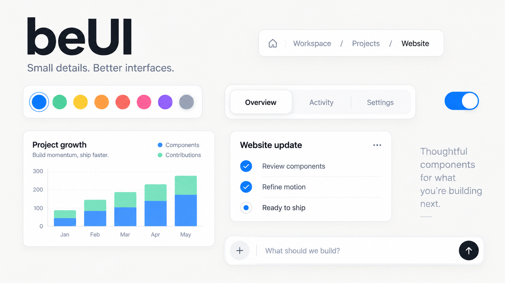

<p align="center">
  <a href="https://beui.dev">
    
  </a>
</p>

<h1 align="center">beUI - Motion Component Library</h1>

<p align="center">
  Animated components for React and Next.js. Copy the source, own the code.
</p>

<p align="center">
  <a href="https://github.com/starc007/ui-components/blob/main/LICENSE"></a>
  <a href="https://github.com/starc007/ui-components/stargazers"></a>
  <a href="https://github.com/starc007/ui-components/actions/workflows/ci.yml"></a>
  <a href="https://ui.shadcn.com/docs/registry"></a>
</p>

<p align="center">
  <a href="https://beui.dev">Website</a>
  ·
  <a href="https://beui.dev/components/motion">Components</a>
  ·
  <a href="https://beui.dev/llms.txt">llms.txt</a>
</p>

<p align="center">
  <a href="https://beui.dev"></a>
</p>

## Interfaces that move with intent

beUI brings motion to everyday product interfaces: buttons, navigation, menus, charts, and AI conversations. Built with React, TypeScript, Tailwind CSS, and Motion, with live previews and copyable usage examples.

- **Own the source.** Install individual components into your app and change them to fit your product.
- **Compose your interface.** Combine focused primitives or start with a complete block.
- **Make motion useful.** Springs, shared layouts, and press feedback communicate state and keep interactions connected.
- **Keep interaction in reach.** Components include keyboard behavior and reduced-motion support where applicable; the project maintains an accessibility test suite.

## Explore the library

| Collection | What you'll find |
| --- | --- |
| [Components](https://beui.dev/components/motion) | Animated breadcrumbs, color selectors, buttons, tabs, tooltips, and other primitives |
| [Blocks](https://beui.dev/components/blocks) | Command palettes, file uploads, signup forms, and composed widgets |
| [AI agents](https://beui.dev/components/agents) | Chat layouts, prompt inputs, messages, approvals, and tool results |
| [Charts](https://beui.dev/charts) | Composition, ranking, funnel, calendar, and financial visualizations |

## Install a component

In a project configured for [shadcn/ui](https://ui.shadcn.com/docs/installation), add a component using the `@beui` namespace:

```bash
npx shadcn@latest add @beui/animated-toast-stack
```

Direct URLs also work:

```bash
npx shadcn@latest add https://beui.dev/r/animated-toast-stack.json
```

Browse a component's page for its preview, usage example, and exact install command. Prefer a manual setup? Copy its source and supporting files from the page instead.

## For AI agents

Connect your coding agent to the public MCP server to discover components and retrieve their source and usage examples. No license key is required:

```txt
https://mcp.beui.dev/mcp
```

See the [AI agents guide](https://beui.dev/docs/ai-agents) for client setup. You can also install the beUI skill to help your agent find and compose existing components:

```bash
npx skills add starc007/ui-components --skill beui
```

For direct access without MCP:

| Endpoint | Contents |
| --- | --- |
| [`/llms.txt`](https://beui.dev/llms.txt) | Documentation index for agents |
| [`/r/registry.json`](https://beui.dev/r/registry.json) | Installable component catalog |
| `/r/{slug}.json` | shadcn-compatible registry item with source and dependencies |
| `/r/{slug}/raw` | Raw component source |

## Run locally

To work on the library or documentation site, install [Bun](https://bun.sh) and clone the repository:

```bash
git clone https://github.com/starc007/ui-components.git
cd ui-components
bun install
bun run dev
```

Open [http://localhost:3000](http://localhost:3000).

### Checks

```bash
bun run check
bun test
```

`bun run check` runs TypeScript, Biome lint, and registry source validation. `bun test` runs the accessibility-only test suite. See [CONTRIBUTING.md](./CONTRIBUTING.md#testing-policy) for the testing policy.

## Contributing

Keep component source, previews, and catalog entries together when adding or changing a component:

| Location | Purpose |
| --- | --- |
| `components/motion/` | Motion primitives and blocks |
| `components/agents/` | AI agent interface components |
| `components/charts/` | Data visualization components |
| `components/previews/` | Demos and public usage examples |
| `lib/registry.ts` | Component catalog and install metadata |
| `lib/ease.ts` | Shared animation tokens |

Read [CONTRIBUTING.md](./CONTRIBUTING.md) for the contribution and testing workflow, and [AGENTS.md](./AGENTS.md) for component and motion conventions.

## Want complete pages and templates?

[beUI Pro](https://pro.beui.dev/?utm_source=github&utm_medium=referral&utm_campaign=free_to_pro&utm_content=readme_callout) includes premium animated sections and full Next.js templates with editable source and private registry access.

Pro customers can install the licensed block workflow:

```bash
npx skills add starc007/ui-components --skill beui-pro
```

## Star history

<a href="https://star-history.dera.page/#starc007/ui-components&Date">
  <picture>
    <source media="(prefers-color-scheme: dark)" srcset="https://star-history.dera.page/svg?repos=starc007/ui-components&type=Date&theme=dark" />
    <source media="(prefers-color-scheme: light)" srcset="https://star-history.dera.page/svg?repos=starc007/ui-components&type=Date" />
    
  </picture>
</a>

## Author

Saurabh Chauhan · [@saurra3h](https://x.com/saurra3h)

## License

[MIT](./LICENSE). Use and adapt beUI in personal and commercial projects.
