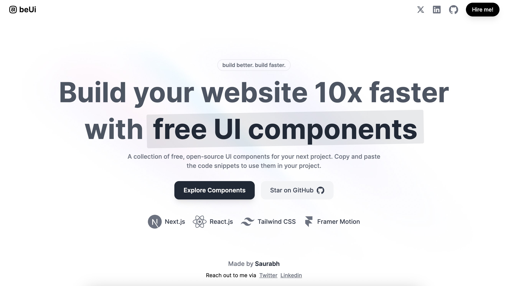

# 
beUi: Build better, Build faster

Build your project 10x faster with free beautiful ui components

## Speed up your development 🚀

1. Pre built customizable ui components ✨
2. Browse, choose, copy and paste it in your project, that's it! 😉

## 🛠️ Tech Stack

- [React](https://reactjs.org/)
- [TypeScript](https://www.typescriptlang.org/)
- [Tailwind CSS](https://tailwindcss.com/)
- [Framer Motion](https://www.framer.com/motion/introduction/)

## 🍰 Contributing

Contributions are what make the open source community such an amazing place to be learn, inspire, and create. Any contributions you make are **greatly appreciated**.

Before contributing, please read the [contributing guidelines](CONTRIBUTING.md).

## 🙇 Reach out to me

#### Saurabh Chauhan

- Twitter: [@saurra3h](https://twitter.com/saurra3h)
- Instagram: [@saurra3h](https://instagram.com/saurra3h)
- Github: [@starc007](https://github.com/starc007)

## ➤ License

Distributed under the MIT License. See [LICENSE](LICENSE) for more information.
